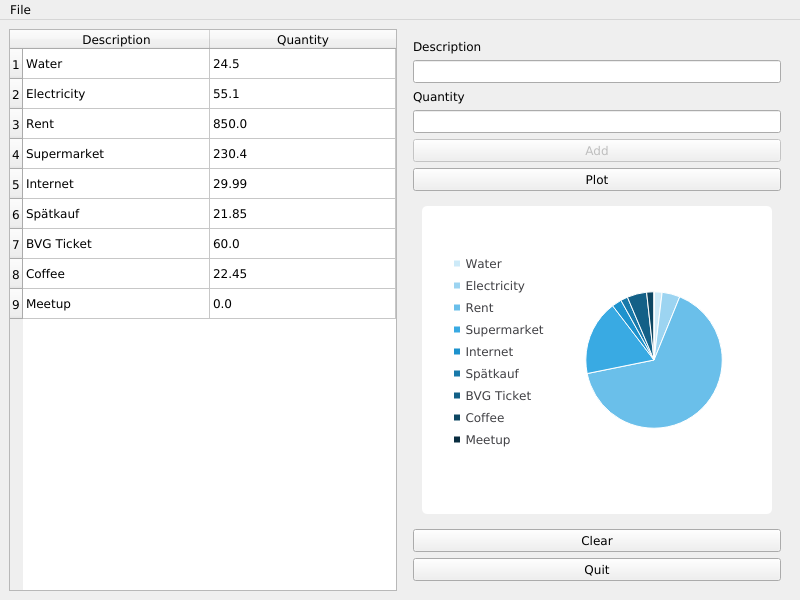

# Workshop tutorial



:warning: Warning

> In general, importing all the classes from a module is not a good practise,
> but we will make an exception to help you focus on the main code.

## Introduction :snake:

On this session we will learn step-by-step how to build
our first Qt for Python application.

You will learn the following concepts:
* Creating interfaces programatically,
* Layouts and widgets,
* QClasses overloading,
* Connecting Signal and slots,
* Interaction with QWidgets, and
* to build your own application :tada:.

:bulb: The requirements:
* A simple window will hold our application ([QMainWindow][1]),
* The application will keep track of our expenses on a list ([QTableWidget][2]),
* Two fields ([QLineEdit][3]), description and quantity,  will be used to enter the
  information,
* Buttons ([QPushButton][4]) will be in charge to add the information to the list,
  plot the data, clear the table content, and exit the application,
* A verification step is needed to avoid entering empty data,
* The data needs to be plotted into a chart ([QChart][5]), that will
  be embedded into a chart view ([QChartView][6]).

## Steps to follow

### Step 01 - Empty window

* Create an empty window based on `QMainWindow` using a separate class.
  (Check the [documentation][7] to set a title for the window)
* On the main section `if __name__ == "__main__":`,
  * Create a [QApplication][7],
  * instantiate the class (empty window),
  * show it, and
  * execute the application.

> Check the solution for this step [01-expenses.py](01-expenses.py)

### Step 02 - Menu bar

* Access the `menuBar` from the [QMainWindow][7], and create a `File` menu,
* Add a [QAction][8] to the menu called "Exit".

> Check the solution for this step [02-expenses.py](02-expenses.py)

### Step 03 - First signal/slot connection

* Connect the "Exit" action, trough its `triggered` **signal**, to a **slot**
  that exit the application.

  **Hint:** Use the following line to exit an application:
  ```python
  QApplication.quit()
  ```

> Check the solution for this step [03-expenses.py](03-expenses.py)

### Step 04 - Empty widget and data

* Create a new class that inherits from [QWidget][9],
* Add the following example data to that class as a variable:
  ```python
  self._data = {"Water": 24.5, "Electricity": 55.1, "Rent": 850.0,
                "Supermarket": 230.4, "Internet": 29.99, "Spätkauf": 21.85,
                "BVG Ticket": 60.0, "Coffee": 22.45, "Meetup": 0.0}
  ```
* Modify the class `MainWindow` to accept a `widget` in its constructor,
* Use the widget to set it as the central widget of the MainWindow class.

  **Hint:**
  `QMainWindow` has method called `setCentralWidget` that you can use.

> Check the solution for this step [04-expenses.py](04-expenses.py)

### Step 05 - Window layout

* Add a [QHBoxLayout][10] to the Widget class,
* Create a [QTableWidget][2] (using 2 columns),
* Add the table to the layout.
* Create a method to fill the information we wrote in **step 04**
  to the table.

  **Hint:**:
  * You need to iterate the dictionary,
  * insert a row to the table (`insertRow`),
  * set the items to the created row (`setItem`)
  * Use a class variable to keep track of the rows.

> Check the solution for this step [05-expenses.py](05-expenses.py)

### Step 06 - Right side layout

* Add another element to the [QHBoxLayout][10] we created in the previous
  step: a [QVBoxLayout][11].
* Add to the [QVBoxLayout][11] labels ([QLabel][12]), line edits ([QLineEdit][3]),
  and buttons (`QPushButton`) to enter the required information.

> Check the solution for this step [06-expenses.py](06-expenses.py)

### Step 07 - Adding elements

* Create a **slot** to add a new element to the list, for the button "Add",
* Create a **slot** to quit the application, for the button "Quit",
* Optional: Create a button to clear the table.

> Check the solution for this step [07-expenses.py](07-expenses.py)

### Step 08 - Verification step

* Disable the "Add" button by default, and
* Add mechanisms to check if both the "description" and the "quantity"
  are not empty to enable the "Add" button,

  **Hint:** Use the `textChanged[str]` signal for [QLineEdit][3].

> Check the solution for this step [08-expenses.py](08-expenses.py)

### Step 09 - Empty chart view

* Add a non-functional new button (under "Add") to "Plot" the data,
* Add an empty [QChartView][6] under the buttons,

> Check the solution for this step [09-expenses.py](09-expenses.py)

### Step 10 - Full application

* Connect the "Plot" button to a slot that:
  * Creates a [QPieSeries][13], and fills it,
  * Create a [QChart][5] using the [QPieSeries][13],
  * Update the chart view to include this newly created [QChart][5].

> Check the solution for this step [10-expenses.py](10-expenses.py)

### Optional step

The following features are for you to try them out,
and are not required for this workshop.

* Add another [QAction][8] to the window menu to load a file as content
  for the table.
* Add another [QAction][8] to save the content of the table into a local
  file so you don't lose your information.
* Use another type of chart to represent the data e.g.: [QBarSeries][14].
* Extend the model to also save the **date** when you added the expenses.

[1]: https://doc.qt.io/qtforpython/PySide2/QtWidgets/QMainWindow.html
[2]: https://doc.qt.io/qtforpython/PySide2/QtWidgets/QTableWidget.html
[3]: https://doc.qt.io/qtforpython/PySide2/QtWidgets/QLineEdit.html
[4]: https://doc.qt.io/qtforpython/PySide2/QtWidgets/QPushButton.html
[5]: https://doc.qt.io/qtforpython/PySide2/QtCharts/QtCharts.QChart.html
[6]: https://doc.qt.io/qtforpython/PySide2/QtCharts/QtCharts.QChartView.html
[7]: https://doc.qt.io/qtforpython/PySide2/QtWidgets/QMainWindow.html
[8]: https://doc.qt.io/qtforpython/PySide2/QtWidgets/QAction.html
[9]: https://doc.qt.io/qtforpython/PySide2/QtWidgets/QWidget.html
[10]: https://doc.qt.io/qtforpython/PySide2/QtWidgets/QHBoxLayout.html
[11]: https://doc.qt.io/qtforpython/PySide2/QtWidgets/QVBoxLayout.html
[12]: https://doc.qt.io/qtforpython/PySide2/QtWidgets/QLabel.html
[13]: https://doc.qt.io/qtforpython/PySide2/QtCharts/QtCharts.QPieSeries.html
[14]: https://doc.qt.io/qtforpython/PySide2/QtCharts/QtCharts.QBarSeries.html
